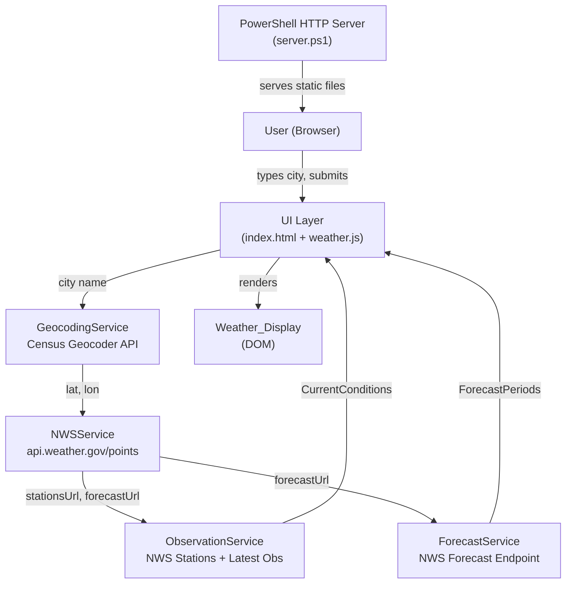
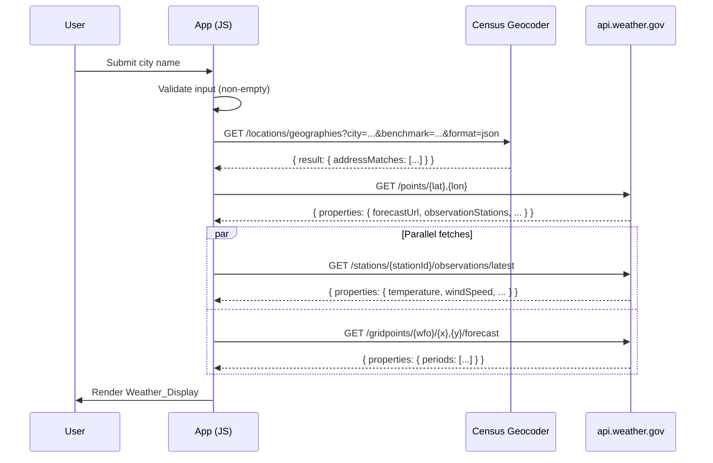

# Design Document: weather-app

## Overview

The weather-app is a single-page HTML/JavaScript application that lets users look up current weather conditions and a 5-day forecast for any U.S. city. It runs entirely in the browser and is served by a local PowerShell HTTP server on `http://localhost:8080`.

The data pipeline is a three-step chain:

1. **Geocoding** — The user's city name is resolved to latitude/longitude coordinates via the U.S. Census Bureau Geocoding API (`geocoding.geo.census.gov`).
2. **NWS Point Lookup** — The coordinates are used to retrieve NWS grid metadata (forecast office, grid X/Y, observation station list URL, and forecast URL) from `api.weather.gov/points/{lat},{lon}`.
3. **Observations + Forecast** — Two parallel requests fetch the latest observation from the nearest station and the 7-day forecast (from which 5 days are displayed).

No API keys, authentication, or third-party services are required. All network requests are made directly from the browser using the `fetch` API with `AbortController`-based timeouts.

### Key Design Decisions

- **Pure client-side JavaScript** — No build tools, bundlers, or frameworks. A single `index.html` and a `weather.js` module keep the project simple and self-contained.
- **Sequential then parallel fetch** — Geocoding and NWS point lookup must be sequential (each depends on the previous result). Observations and forecast fetches are independent once the NWS point is resolved, so they run in parallel via `Promise.allSettled`.
- **`Promise.allSettled` for resilience** — Allows the app to display current conditions even when the forecast fetch fails, satisfying Requirement 3.8.
- **Inline SVG icons** — Weather icons are rendered as inline SVG strings mapped from condition categories, avoiding external image dependencies.
- **PowerShell HTTP server** — A self-contained `.ps1` script uses `System.Net.HttpListener` to serve static files, requiring no Node.js, Python, or other runtimes.

---

## Architecture



The app has no backend logic — the PowerShell server is a static file server only. All API calls originate from the browser.

### Request Flow



---

## Components and Interfaces

### 1. `index.html`

The single HTML file containing:
- The `City_Input` text field and submit button (Requirement 1.1)
- A loading indicator element (hidden by default)
- An error message region (dedicated, non-overlapping with weather display — Requirement 3.6)
- The `Weather_Display` section (current conditions card + forecast table)
- A `<script type="module">` tag loading `weather.js`

### 2. `weather.js`

The main JavaScript module. Organized into logical sections:

#### `GeocodingService`

Responsible for resolving a city name to coordinates.

```
geocodeCity(cityName: string): Promise<{ lat: number, lon: number, city: string, state: string }>
```

- Calls: `https://geocoding.geo.census.gov/geocoder/locations/geographies?city={city}&state={state}&benchmark=Public_AR_Current&vintage=Current_Current&layers=all&format=json`
- Parses `result.addressMatches[0].coordinates` for `x` (longitude) and `y` (latitude)
- Parses `result.addressMatches[0].geographies["Incorporated Places"][0].NAME` for display name
- Throws `GeocodingError` with appropriate message on zero results or HTTP error

#### `NWSService`

Responsible for fetching NWS grid metadata.

```
getPoint(lat: number, lon: number): Promise<NWSPoint>
```

- Calls: `https://api.weather.gov/points/{lat},{lon}`
- Returns `{ forecastUrl, observationStationsUrl, city, state }` from `properties`
- Throws `NWSError` on non-200 or timeout

#### `ObservationService`

Responsible for fetching the latest weather observation.

```
getLatestObservation(observationStationsUrl: string): Promise<CurrentConditions>
```

- First calls `observationStationsUrl` to get the list of stations
- Takes `features[0].properties.stationIdentifier` as the station ID
- Calls: `https://api.weather.gov/stations/{stationId}/observations/latest`
- Returns a `CurrentConditions` object
- Throws `NWSError` if station list is empty (Requirement 2.3)

#### `ForecastService`

Responsible for fetching the 7-day forecast.

```
getForecast(forecastUrl: string): Promise<ForecastPeriod[]>
```

- Calls the `forecastUrl` from the NWS point response
- Returns the first 10 `properties.periods` (5 day/night pairs)
- Throws `NWSError` on failure

#### `WeatherIconMapper`

Maps a weather description string to a `Weather_Icon`.

```
getIcon(description: string): string  // returns inline SVG or Unicode
```

- Matches description (case-insensitive) against categories in priority order:
  1. `thunderstorm` → ⛈ SVG
  2. `snow` / `snowy` / `blizzard` → ❄ SVG
  3. `rain` / `rainy` / `shower` / `drizzle` → 🌧 SVG
  4. `cloud` / `cloudy` / `overcast` → ☁ SVG
  5. `partly cloudy` / `partly sunny` / `mostly cloudy` → ⛅ SVG
  6. default (sunny/clear) → ☀ SVG

#### `UIController`

Orchestrates the full lookup flow and manages DOM state.

```
handleSubmit(): Promise<void>
showLoading(): void
hideLoading(): void
showError(message: string): void
clearError(): void
renderCurrentConditions(conditions: CurrentConditions, cityName: string): void
renderForecast(periods: ForecastPeriod[]): void
clearDisplay(): void
```

#### `fetchWithTimeout`

A utility wrapper around `fetch` using `AbortController`.

```
fetchWithTimeout(url: string, timeoutMs: number): Promise<Response>
```

- Default timeout: 10 000 ms (Requirement 1.8, 2.6)
- Throws `TimeoutError` if the signal fires before the response arrives

### 3. `server.ps1`

A PowerShell script using `System.Net.HttpListener`:

- Listens on `http://localhost:8080/`
- Serves files from its own directory
- Maps file extensions to `Content-Type` headers (Requirement 5.3)
- Returns `index.html` for root requests (Requirement 5.2)
- Returns HTTP 404 for missing files and non-root directory paths (Requirement 5.6, 5.7)
- Prints startup message on success (Requirement 5.4)
- Catches port-in-use errors and exits with a message (Requirement 5.5)

---

## Data Models

### `GeocodingResult`

```javascript
{
  lat: number,       // latitude (y from Census response)
  lon: number,       // longitude (x from Census response)
  city: string,      // resolved city name for display
  state: string      // two-letter state abbreviation
}
```

### `NWSPoint`

```javascript
{
  forecastUrl: string,             // e.g. https://api.weather.gov/gridpoints/EWX/68,91/forecast
  observationStationsUrl: string,  // e.g. https://api.weather.gov/gridpoints/EWX/68,91/stations
  city: string,                    // from properties.relativeLocation.properties.city
  state: string                    // from properties.relativeLocation.properties.state
}
```

### `CurrentConditions`

```javascript
{
  temperatureF: number | null,     // converted from Celsius: (C * 9/5) + 32, rounded to whole number
  description: string | null,      // textDescription from observation
  windSpeedMph: number | null,     // converted from km/h: value * 0.621371, rounded
  windDirection: string | null,    // cardinal abbreviation derived from windDirection.value (degrees)
  relativeHumidity: number | null  // percentage, rounded to whole number
}
```

> NWS observation values use SI units. Temperature is in °C, wind speed in km/h, humidity as a percentage. Conversion to °F and mph happens in `ObservationService` before returning `CurrentConditions`. Any `null` value is displayed as "N/A" (Requirement 2.7).

### `ForecastPeriod`

```javascript
{
  name: string,            // e.g. "Monday", "Monday Night"
  startTime: string,       // ISO 8601 date-time string
  isDaytime: boolean,
  temperatureF: number,    // already in °F from NWS forecast endpoint
  shortForecast: string,   // e.g. "Partly Cloudy"
  icon: string             // mapped by WeatherIconMapper
}
```

### `ForecastDay` (derived, for display)

The forecast table groups day/night pairs. For each of the 5 days:

```javascript
{
  date: string,        // formatted from startTime of the daytime period
  highF: number,       // temperature from the daytime period
  lowF: number,        // temperature from the nighttime period
  description: string, // shortForecast from the daytime period
  icon: string         // icon from the daytime period
}
```

### Error Types

```javascript
class GeocodingError extends Error { }  // city not found, geocoder unavailable
class NWSError extends Error { }        // NWS API errors
class TimeoutError extends Error { }    // fetch timeout
```

---

## Correctness Properties

*A property is a characteristic or behavior that should hold true across all valid executions of a system — essentially, a formal statement about what the system should do. Properties serve as the bridge between human-readable specifications and machine-verifiable correctness guarantees.*

### Property 1: Temperature conversion round-trip

*For any* Celsius temperature value in the range –100°C to 60°C, converting to Fahrenheit using `(C * 9/5) + 32` and rounding to a whole number should produce a value that, when converted back to Celsius, is within 0.5°C of the original value.

**Validates: Requirements 3.1**

### Property 2: Wind direction mapping covers the full circle

*For any* wind direction value in degrees from 0 to 359, the `degreesToCardinal` function should return one of the 16 standard cardinal/intercardinal abbreviations (N, NNE, NE, ENE, E, ESE, SE, SSE, S, SSW, SW, WSW, W, WNW, NW, NNW), and the same input should always produce the same output.

**Validates: Requirements 3.1**

### Property 3: Icon mapping is total and deterministic

*For any* weather description string (including empty strings, mixed case, and multi-word descriptions), `WeatherIconMapper.getIcon` should return a non-empty string and never return `null`, `undefined`, or an empty string. The same description should always return the same icon.

**Validates: Requirements 3.2**

### Property 4: Icon category priority is respected

*For any* weather description string that contains keywords matching multiple icon categories, the icon returned should correspond to the highest-priority matching category in the defined order: thunderstorm > snow > rain > cloudy > partly cloudy > sunny/clear.

**Validates: Requirements 3.2**

### Property 5: Null observation values always render as "N/A"

*For any* `CurrentConditions` object where any combination of fields (temperature, description, windSpeed, windDirection, relativeHumidity) are `null`, the rendered HTML for each null field should contain the string "N/A" and should not contain the literal strings "null", "undefined", or an empty value.

**Validates: Requirements 2.7**

### Property 6: Forecast grouping always produces exactly 5 days

*For any* array of exactly 10 forecast periods in alternating daytime/nighttime order, grouping them into `ForecastDay` objects should produce exactly 5 entries, each containing a non-null date, highF, lowF, description, and icon derived from the first 10 periods of the NWS response.

**Validates: Requirements 2.4, 3.3**

### Property 7: Invalid input is rejected and City_Input is preserved

*For any* string composed entirely of whitespace characters (spaces, tabs, newlines), or any city name that results in a lookup failure (geocoding error, network error, or NWS error), the input validation or error handler should reject the submission, display an error message, and leave the `City_Input` field value equal to the originally submitted string.

**Validates: Requirements 1.3, 1.10**

### Property 8: HTTP error status codes trigger service-identified error messages

*For any* HTTP status code in the range 400–599 returned by any API (Census Geocoder or NWS), the error message displayed to the user should identify the failing service by name (e.g., "Location service" or "Weather service") and should not contain raw status codes or stack traces.

**Validates: Requirements 2.5, 4.1**

### Property 9: First geocoding result's coordinates are always used

*For any* Census Geocoder response containing one or more address matches, the coordinates passed to the NWS point lookup should always equal the `x` (longitude) and `y` (latitude) values of the first element in the `addressMatches` array.

**Validates: Requirements 1.6**

### Property 10: First observation station is always used

*For any* NWS observation stations response containing one or more station features, the station identifier used for the latest observation request should always equal the `stationIdentifier` of the first element in the `features` array.

**Validates: Requirements 2.2**

---

## Error Handling

### Error Classification

| Scenario | Error Type | User Message |
|---|---|---|
| Empty city input | Validation | "Please enter a city name." |
| Census returns 0 results | `GeocodingError` | "City not found. Check the spelling and try again, e.g. 'Austin, TX'." |
| Census request timeout | `TimeoutError` | "Location service timed out. Please try again later." |
| Census HTTP 4xx/5xx | `GeocodingError` | "Location service is unavailable. Please try again later." |
| NWS `/points` non-200 | `NWSError` | "Weather data is unavailable for this location." |
| NWS `/points` timeout | `TimeoutError` | "Weather service timed out. Please try again later." |
| Empty observation station list | `NWSError` | "No observation stations are available for this location." |
| NWS observation non-200 | `NWSError` | "Weather data is unavailable for this location." |
| NWS forecast non-200 | `NWSError` | Shown in forecast table area only: "Forecast is unavailable for this location." |
| NWS forecast timeout | `TimeoutError` | Shown in forecast table area only: "Forecast service timed out." |

### Error Display Rules

- All errors are shown in a dedicated `#error-region` element above the `Weather_Display` (Requirement 3.6).
- Raw HTTP status codes, stack traces, and API error bodies are never shown to the user (Requirement 3.6).
- When a new lookup starts, the error region is cleared (Requirement 3.7).
- If the forecast fetch fails independently, current conditions are still shown and the error appears only in the forecast table area (Requirement 3.8).
- The `City_Input` value is preserved on any error (Requirement 1.10).

### Timeout Strategy

All `fetch` calls are wrapped in `fetchWithTimeout(url, 10000)`. The `AbortController` signal is passed to `fetch`. If the signal fires, a `TimeoutError` is thrown and caught by the calling service, which re-throws with a user-friendly message.

---

## Testing Strategy

### Unit Tests

Unit tests cover pure functions and data transformation logic. Recommended framework: **Jest** (or Vitest for a zero-config alternative), run in Node.js with jsdom for DOM tests.

Focus areas:
- `WeatherIconMapper.getIcon` — all 6 categories, edge cases (empty string, mixed case, multi-word descriptions)
- `degreesToCardinal` — boundary values at each of the 16 sectors
- Temperature conversion (°C → °F) — known values and rounding
- Wind speed conversion (km/h → mph) — known values and rounding
- Input validation — empty string, whitespace-only, valid city, "City, ST" format
- `ForecastDay` grouping — 10 periods → 5 days, odd/even pairing
- Error message selection — each error type maps to the correct user-facing string

### Property-Based Tests

Property-based testing is appropriate for this feature because several components are pure transformation functions with large input spaces where edge cases matter. Recommended library: **fast-check** (JavaScript).

Each property test runs a minimum of 100 iterations.

Tag format: `// Feature: weather-app, Property {N}: {property_text}`

| Property | Test Description | fast-check Arbitraries |
|---|---|---|
| P1: Temperature conversion | Round-trip °C → °F → °C within 0.5° | `fc.float({ min: -100, max: 60 })` |
| P2: Wind direction mapping | All degrees 0–359 map to a valid cardinal | `fc.integer({ min: 0, max: 359 })` |
| P3: Icon mapping is total | Any string returns non-empty icon | `fc.string()` |
| P4: Icon priority | Multi-match descriptions respect priority order | `fc.constantFrom(...)` with combined descriptions |
| P5: Null values render as N/A | Any combination of null fields renders "N/A" | `fc.record(...)` with nullable fields |
| P6: Forecast grouping | 10 periods always produce exactly 5 ForecastDay entries | `fc.array(forecastPeriodArb, { minLength: 10, maxLength: 10 })` |
| P7: Invalid input rejected, input preserved | Whitespace-only or error-causing input leaves City_Input unchanged | `fc.stringOf(fc.constantFrom(' ', '\t', '\n'))` + error mocks |
| P8: HTTP errors show service-identified message | Status codes 400–599 produce named-service error messages | `fc.integer({ min: 400, max: 599 })` |
| P9: First geocoding result used | Any multi-match response always uses first match's coordinates | `fc.array(addressMatchArb, { minLength: 1 })` |
| P10: First observation station used | Any multi-station response always uses first station's ID | `fc.array(stationArb, { minLength: 1 })` |

### Integration Tests

Integration tests verify the full API call chain using mocked `fetch` responses (e.g., with `jest.spyOn(global, 'fetch')`):

- Happy path: geocoding → NWS point → observation + forecast → full display rendered
- Geocoding zero results → error message shown, input preserved
- NWS point 500 error → weather unavailable error shown
- Empty station list → no stations error shown
- Forecast fetch fails, observation succeeds → current conditions shown, forecast error in table area
- Timeout on any fetch → timeout error message shown

### PowerShell Server Tests

Manual verification checklist for `server.ps1`:
- Root path `/` returns `index.html` with status 200
- `.js` file returns `application/javascript` content-type
- Missing file returns 404
- Non-root directory path returns 404
- Port already in use prints error and exits
